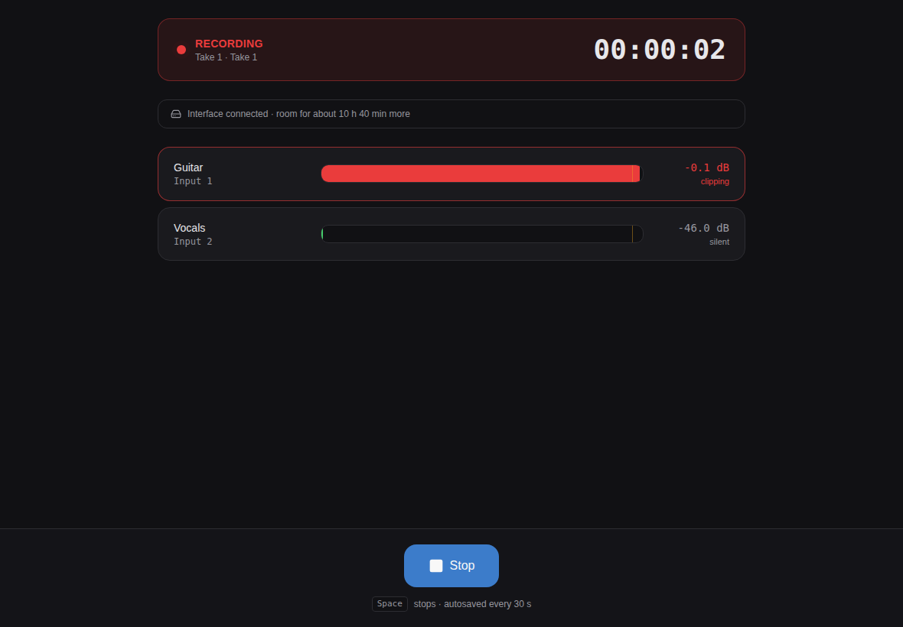
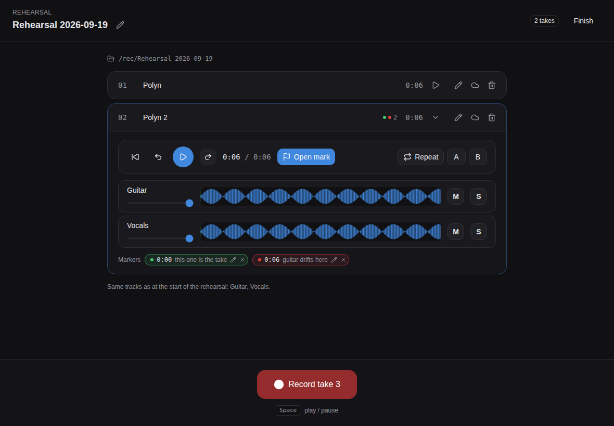
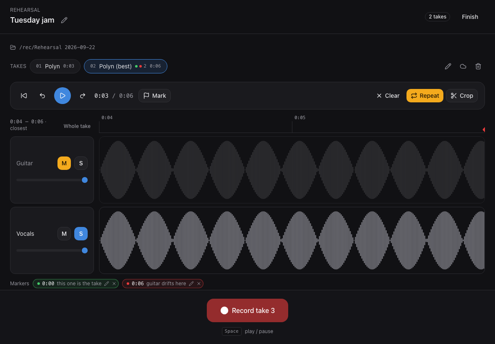
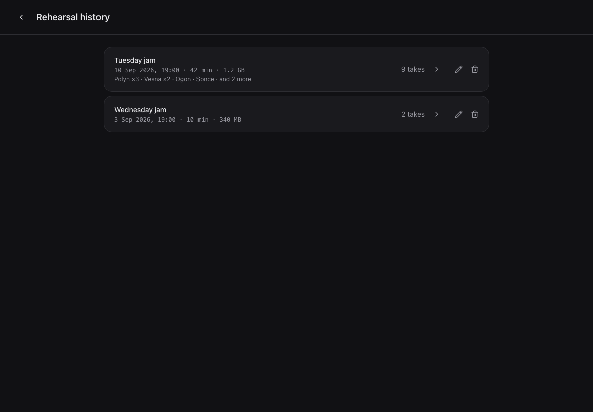
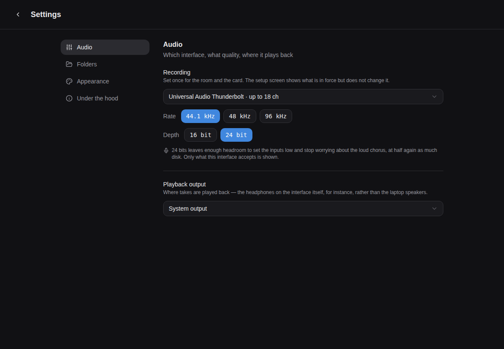

# Rehearsal Recorder

Multitrack recording for band rehearsals. One track per musician, written to
disk as you play, a take you can listen back to the second you stop, and a
history of every rehearsal you have ever had.

Built for the situation it is actually used in: nobody is watching the screen
while the band plays, nobody is riding the gain, the laptop might get kicked,
and there may be no internet in the room.

## Get it

Download the build for your system from
[Releases](../../releases), unzip, open. Nothing to install — Python, the
audio libraries and the interface are all inside.

**On Windows, unblock the zip before you unpack it.** Right-click the
downloaded file, choose **Properties**, tick **Unblock** at the bottom, then
extract. Windows marks everything that arrives from the internet and passes
that mark on to every file unpacked from a marked archive, and it will not
load the app's audio libraries while they carry it — the app fails to start
with errors that do not say why. Unblocking the zip clears it for everything
inside in one go. Unpack first and you are unblocking fifty files by hand.

The first launch then has one more hurdle, once, because the app is not
signed with a paid developer certificate: on macOS right-click it and choose
**Open** instead of double-clicking; on Windows click **More info** then
**Run anyway**. After that both open normally. macOS also asks for
microphone permission the first time you record.

No release yet, or you want to build it yourself? Double-click
**`build.command`** on macOS or **`build.bat`** on Windows — they are in the
root of this folder for exactly that reason. Each makes its own environment
inside the folder, builds the interface, packages the app, tests it, and
tells you where it landed. That step needs Python and Node installed; the app
it produces needs neither.

## What it does

**Records every musician to their own track** and keeps writing to disk the
whole time, forcing everything out every 30 seconds. If the app dies, the
laptop sleeps, or someone trips over the interface, you lose seconds — and
the interrupted take is offered back to you at the next launch.

**Tells you it is fine while it is running.** The interface is connected, the
disk has room for this long, this input is clipping, that one is silent. Not
buried in a menu: on screen during the take, because that is the only moment
anyone would act on it.

**Plays the take back immediately**, all tracks in sync, with per-track
volume, mute and solo, and markers you drop while listening. Every track
shares one timeline, so where two of them parted company is something you can
point at rather than guess. Drag across it to set the repeat region, and zoom
into it with the wheel when the spot needs finding exactly.

**Markers say what happened, not just where.** A note and a kind — keep this,
went wrong, do again — coloured on the timeline and on the take's pill, so a
glance at the strip says which take has red in it.

**Tells you what a rehearsal was.** Months later a date and a take count are
not how anyone recognises an evening, so each one says what was played in it,
how long it ran and what it weighs on disk. It is read from the take names,
so nothing extra has to be filled in while you are playing.

**Sends the good ones to the cloud.** A whole rehearsal is mostly failed
attempts, so the recordings folder does not sync — only the takes you keep,
copied to a folder your Drive or Dropbox client watches, as WAV, FLAC or MP3.
Pick them one at a time, or switch on automatic sending and every take you
save goes up on its own, between takes rather than while one is recording.

**Records at the quality the card can actually do.** 16- or 24-bit, at 44.1,
48 or 96 kHz, and only the combinations your interface accepts are offered —
the card is asked before the choice is shown rather than after it fails.
24-bit is the default: at a rehearsal nobody watches the gain, and the
headroom is worth the extra disk.

**Never destroys anything.** Deleting means the Trash, or a `_deleted` folder
where there is no Trash to reach. A recording of a rehearsal cannot be made
again.

## Where the rest of it is

- **[docs/using-it.md](docs/using-it.md)** — the guide. Every screen, what the
  player does, recording quality, cloud copies, where the files live, and what
  protects a recording.
- **[docs/development.md](docs/development.md)** — running it from source,
  the hot-reload loop, and what every file in here is for.
- **[docs/building.md](docs/building.md)** — packaging it into an app, and
  cutting a release.
- **[docs/design-notes.md](docs/design-notes.md)** — the decisions that look
  odd until you know why, including the ones that were wrong the first time.
- **[tests/README.md](tests/README.md)** — the three suites and what each is
  for. `python tests/run_all.py` runs all of them.
- **[CHANGELOG.md](CHANGELOG.md)** — what changed, newest first.

## Contributing

See [CONTRIBUTING.md](CONTRIBUTING.md), and
[docs/development.md](docs/development.md) for how to run it while you work
on it. Bug reports about something that went wrong at an actual rehearsal are
the most useful thing there is.

## License

MIT — see [LICENSE](LICENSE).
