# Using РЭХА

This guide follows a rehearsal from start to finish: setting up, recording
takes, listening back and sharing the good ones. The last sections cover what
to do when something goes wrong, and where your recordings are kept.

## Before you play

### Choose your interface

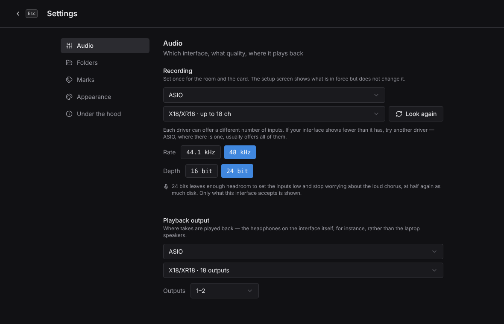

Open **Settings** (the gear at the top right) and choose your audio interface
under **Audio**. You usually do this once for the room, not before every
rehearsal.

On Windows you choose a driver first, then the interface. Choose **ASIO** if
your interface has an ASIO driver: it usually gives you all the inputs, while
the other drivers often show only two. If there is no ASIO driver, choose
**Windows WASAPI**.

Then choose the **Rate** and **Depth**. Only the combinations your interface
accepts are offered. See [Recording quality](#recording-quality) if you are
not sure which to pick.

Under **Playback output**, choose where takes are played back, for example
the headphone outputs of your interface instead of the laptop speakers. Each
device shows how many outputs it has. Under **Outputs**, choose which of them
to use: a pair such as 3–4, or one output on its own. On Windows a driver
other than ASIO often shows an interface with only two outputs; choose it
under **ASIO** to get all of them. The system output always plays through
1–2.

### Set up the tracks

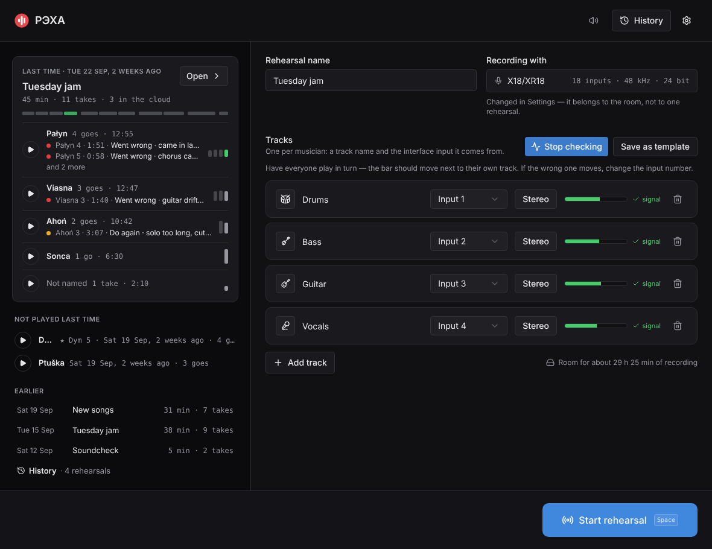

The setup screen has one track per musician: a name and the input it comes
in on. The line under **Recording with** shows the interface, how many inputs
it has and the recording quality. Click it to open Settings.

- Type a name for the rehearsal, or keep the date.
- Name the tracks and choose each one's input.
- **The icon** at the start of a row says what the track is. Click it and
  choose one: vocals, electric or acoustic guitar, bass, drums, keys and
  more. It is shown on the recording screen and in the player. A new track
  has a plain one until you choose.
- **Add track** adds a musician, and the bin icon removes one.
- **Stereo** records an input and the next one together as one stereo track,
  for a keyboard or a pair of overhead microphones. See
  [Stereo instruments](#stereo-instruments).

The tracks, their icons and their inputs are saved when you start the
rehearsal, and they are filled in for you next time. **Save as template** saves them without
starting.

### Check the signal

Press **Check signal** and have everyone play in turn. The bar next to each
track should move when that person plays. If the wrong bar moves, change the
input of that track. A track shows **signal** once sound has arrived on it;
a stereo track needs sound on both sides.

The free disk space is shown under the tracks, as recording time: "Room for
about 29 h 25 min of recording". It takes the number of tracks and the
recording quality into account.

### Last time

Left of the tracks, or under them in a narrow window, is the rehearsal before
this one, song by song: how many goes each song got and how long they ran,
with the notes you left while listening. ▶ on a song plays its newest
starred take (★), wherever you played it, and says which and when if it is
not last time's last go. A song with no star plays its last go, which is
usually the version you settled on. Listen to where you left off before you
start.

Under it are the songs you did not play last time, each with the day it was
last played and its newest starred take, or its last go, to listen to, and
the rehearsals before that. **Open**, or a rehearsal in the list, opens it in
History, and **History** under the list opens the newest, as the button at
the top does. A soundcheck with no named takes is skipped: last time is the
last rehearsal that played a song.

While something plays from here, Space pauses it and Esc stops it; then
Space starts the rehearsal again. **Check signal** stops it.

## Recording takes

### The rehearsal screen

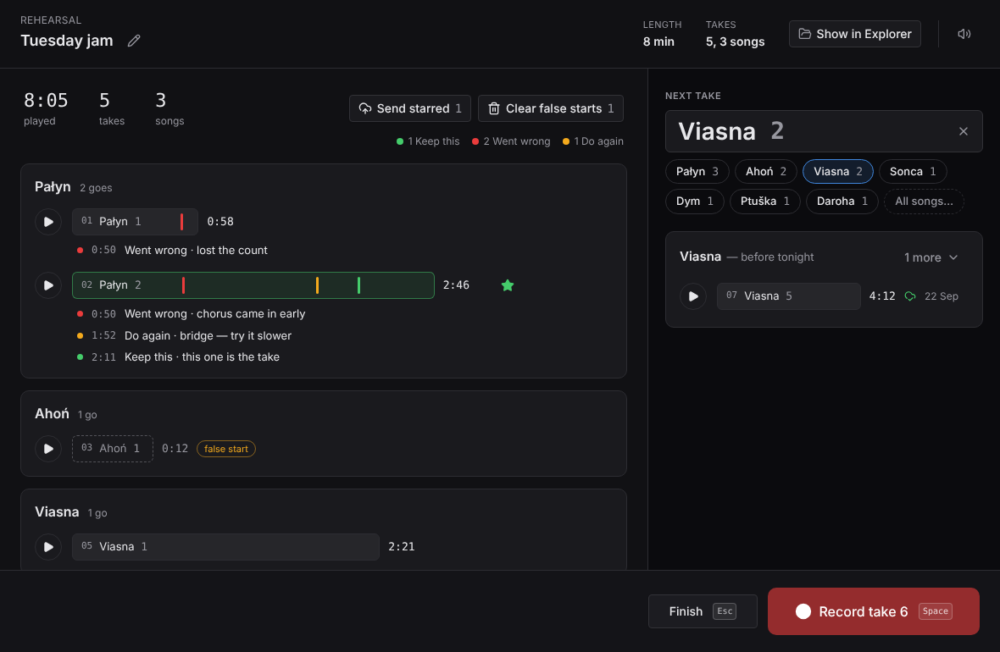

Press **Start rehearsal**, or Space. The rehearsal screen shows the takes
recorded so far, grouped by song. Each take is a bar drawn to its length,
with its markers on it and its notes under it, so a go that ran long or
stopped short stands out before you read anything.

- **Play** at the start of a row plays the take right there. Space pauses
  and continues it, and Esc stops it.
- Click anywhere on a take's row, the bar or past it, to open the take in
  the player. If it is playing, it goes on playing from the same place.
- Click a note to open its take at that spot.
- Point at a row to star the take (★, see *Starring a take*), rename it, send
  it to the cloud or delete it. The ★ stays in view on a starred take.

The evening is sorted here, as it goes, while everyone still remembers
which go was the good one. None of it has to be done:

- A take nobody named has the songs under it, the same ones as under Next
  take. Click one to name the take after that song: it becomes the song's
  next go and moves into the song's group. For a song nobody has played
  yet, use the pencil.
- A take shorter than 30 seconds, with no ★ and no marks, is a false
  start: a count-in, or a stop after eight bars. Its bar is dashed, its
  name and length are grey, and it says **false start**. **Clear false
  starts**, over the takes, moves them all to the Trash, after asking,
  and their copies in the cloud go with them. How short a false start is
  can be changed in **Settings → Folders**, from 5 to 120 seconds.
- **Send starred**, beside it, sends every ★ take that is not in the
  cloud folder yet, as **What gets published** in Settings says. See
  [Sending takes to the cloud](#sending-takes-to-the-cloud).

Each of the two buttons shows how many takes it would act on. With none
it is greyed, and pointing at it says why. In a narrow window the buttons
go on a line of their own under the figures.

Press **Record take**, or Space, to start recording. **Finish** ends the
rehearsal and goes back to the start screen, where Last time shows the
evening just finished. Closing the app instead loses nothing: every take
you saved is kept.

The top of the window says what there is so far, beside the rehearsal's
name: how long its takes run, how many takes there are and of how many
songs, how many are in the cloud, and how much of the disk the rehearsal
uses. **Show in Finder** (**Show in Explorer** on Windows) opens its folder.
In a narrow window only the length, the takes and the button fit. The player
in History has the same header.

On the right is **Next take**: the name the next take will get, in a
field of its own, and under it, in two rows, the songs you could play
instead: tonight's first, as the next go at each ("Pałyn 3"), then the
songs of earlier rehearsals, the latest first. **All songs…** at the end
lists every song you have ever played, in alphabetical order. Typing in
the field narrows the songs to the ones that match. When you move on to
another song, click it before you press Record, or type a name and press
Enter. The take is then recorded under that name, and the recording
screen can say how long the last go at that song took. ✕ puts back the
name the take would have had anyway. If you discard the take, the next
one keeps the name you picked.

Under the songs is how the song in the field went before tonight, so "how
did we play the bridge last week?" needs no trip to History. It shows one
go: the song's newest starred go (★), or, with none starred, the last go of
the last rehearsal that played it, with the day it was played. The button
at its right, **2 more** for example, adds the last go of each of the three
latest rehearsals that played it. The goes play right there, with their
notes under them:

- **Play** plays the go. Space pauses and continues it, and Esc stops it.
- Click a note to play the go from a few seconds before it.
- Picking another song, or pressing **Record take**, stops it.

A song nobody has played before tonight says so. While a take is open in
the player, the earlier goes are hidden.

### While recording

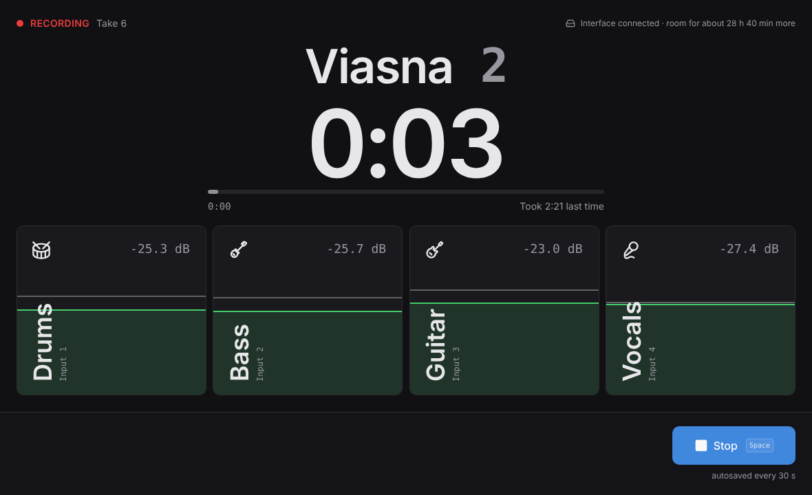

The recording screen is made to be read from where you play, not from the
laptop.

- **The take's name** is over the clock, half its size, so you can see from
  where you stand what you are recording. A take nobody named says "Take 3"
  there: that is the sign the name was forgotten. Put it right after Stop.
  The take's number is up top, beside the red RECORDING.
- **The clock** shows how long the take has been running.
- **The bar under it** shows up when this is another go at a song you have
  already played in this rehearsal: "Took 2:21 last time". The first go of
  the evening at a song played before is measured against the go the
  rehearsal screen showed for it: "Took 3:20 on 22 Sep". It fills as you
  play, so you can see how far into the song you are.
- **Each track has a tile** that fills from the bottom with its level. The
  fill is in dB, like the meters on a mixer: −60 dB at the bottom, full
  scale at the top. If the gain is set so that the loudest hit reaches about
  −18 dB on the mixer, that hit fills about two thirds of the tile. The fill
  jumps up with each hit and sinks back slowly, as on a mixer. The figure at
  the top is the latest peak, held for a moment so that it can be read. The
  track's icon is in the top left corner. A stereo track is split down the
  middle, left and right. A tile that clipped turns red and says how many
  times, "clipped 3×", and stays red until the take ends, so you still see
  it when you look up if you were playing when it happened. A tile with
  nothing coming in, below −60 dB, goes dim, which is normal while someone
  is not playing.

The top corner says that the interface is connected and how much recording
time the disk has left. It turns yellow when the disk is about to run out.

Every track is written to disk while you play, so there is nothing to save
during a take. Press **Stop**, or Space, when the song is over.

### Keep the take or not

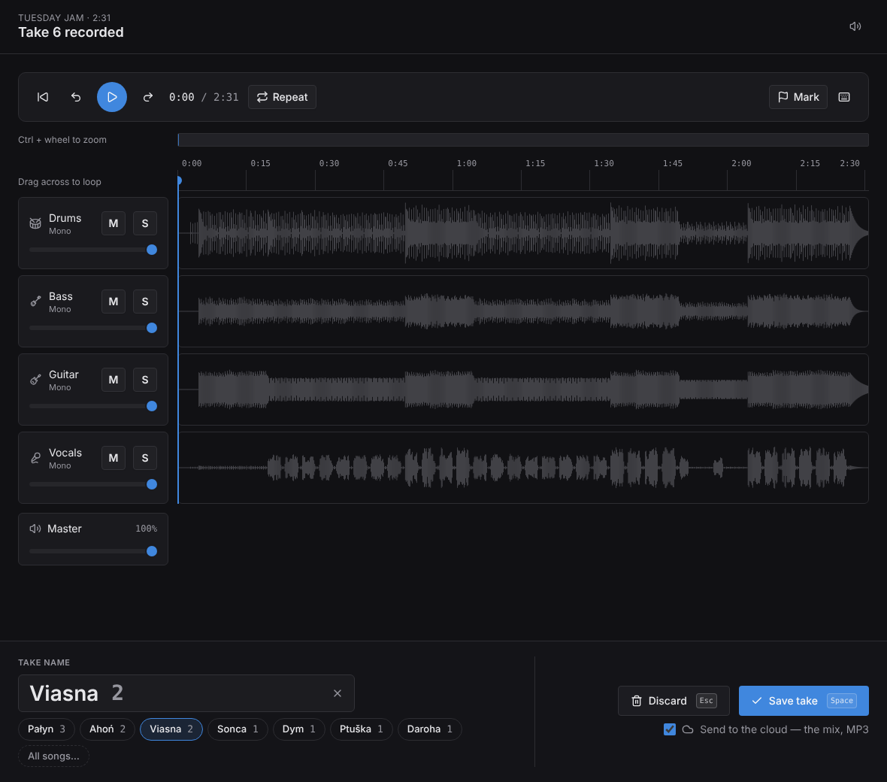

After you stop, the take opens straight away so you can listen to it. The
name it was recorded under is in the name field at the bottom left: check
it, then press **Save take** (Space) or **Discard**. ✕ there puts back
the name the take would have had if none had been picked before recording.
A discarded take goes to the Trash. Pressing Esc also discards it, but asks
first. If you are typing the name, the first Esc only leaves the name
field.

The name is filled in for you. After a take called "Pałyn", the next one is
called "Pałyn 2". Under the name are the songs you have played: this
rehearsal's first, then the others, most recent first. Click one to name the
take after it, then press Space to save. See [Names and songs](#names-and-songs).

If you have a cloud folder, a checkbox under the buttons shows whether this
take will be sent there. Changing it affects this take only.

You can listen, add markers and crop the take here, before you save it. The
markers are saved with the take.

## Listening back

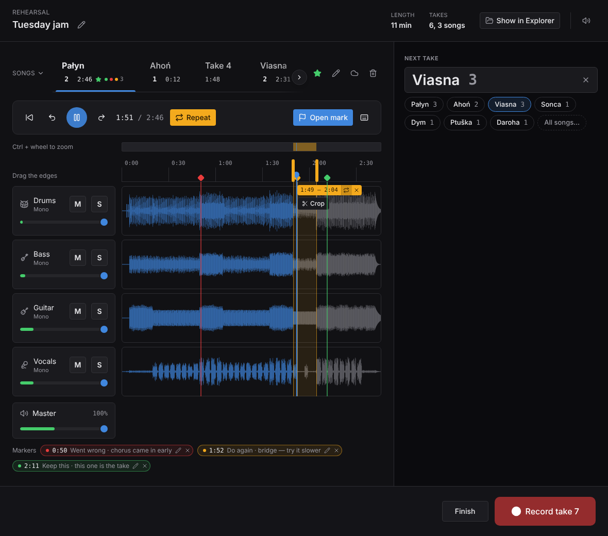

The strip at the top has a tab for each song of the evening, in the order
they were first played, and one for each take with no song. Under a song's
name is its go that is open, or on another tab the go a click on it opens:
the song's last go that evening. **Songs** at the start of the strip, or the
open go's number, opens the tabs out into a column of goes each. Click a go
in a column to open it. All a take's tracks play together on one timeline,
so they always stay in sync.

Another go at the same song opens at the same place: the same second, the
same selection, Repeat on or off, the same zoom, and playing if the last
one was. Loop the chorus of one go, then open the next to hear the same
bars. The goes don't line up exactly, but close enough to find a chorus by
ear. ↑ and ↓ go to the previous and next go at the song the same way.
Another song's go opens from its start. Opened from a song's page in
History, the song's column has every go at it from every rehearsal, the
oldest first, under each rehearsal's day, and ↑ and ↓ go on from one
rehearsal into the next.

- **Play and pause** with the big button or Space. The arrow keys jump 10
  seconds back and forward, and Home goes back to the start. Click anywhere
  on the tracks to jump there.
- **Each track** shows its icon and name, and whether the file is **Mono**
  or **Stereo**.
- **Balance the band** with the fader under each track name. **M** mutes a
  track and **S** plays it on its own. Volumes are remembered by track name,
  so the next take starts with the same balance.
- **Turn the whole take up or down** with **Master** under the tracks. It
  only changes how loud you hear it. The balance and the copy sent to the
  cloud stay as they are. The app remembers it for the next take. Its meter
  shows the whole mix, and turns red when the tracks together are too loud.
  The speaker at the top of the window is the same control, there on every
  screen a take can be played from, even with no take open.
- **Mark a moment** with **Mark**, or the M key, while the take plays. Pick
  its label and type a short comment if you like. A new mark has the first
  label in the list (see [Marks and their labels](#marks-and-their-labels)).
  A mark is drawn in its label's colour on the waveform, and the go's line
  in the strip shows those colours too, so you can see which takes were
  marked what without opening them. Click a marker to jump to it.
- **Loop a part:** drag across the tracks to select it, then turn on
  **Repeat**, next to the time, or the loop button beside the selection's
  times. Drag the edges on the ruler to adjust the selection. The cross
  beside its times removes the selection. It leaves the take as it was.
- **Trim a take:** select the part worth keeping and press **Crop**, under
  the selection's times. The rest goes to the Trash, and the markers inside
  the part move with it.

A few things about cropping:

- Markers outside the part you keep are removed. The app tells you how many
  before it crops.
- **Crop** is greyed out when the selection is shorter than a second, or when
  it covers the whole take.
- If the take was already copied to the cloud folder, that copy no longer
  matches and is removed. With automatic sending on, the cropped take is sent
  again right away. Otherwise, send it again by hand.
- The part you cut off is in the Trash, as one folder named after the take.
  To get the audio back, move its files back into the take's folder. The app
  still shows the shorter length, and the markers stay where the crop moved
  them.

Press Esc to close the take. With the strip's columns open, the first Esc
closes them. If the take is playing, it goes on playing in the list of
takes; press Esc again to stop it. While a take is open or playing,
Space plays and pauses it instead of starting a new recording.

### Starring a take

A star (★) marks a take worth coming back to: the version you settled on,
or the one where it finally worked. Click the star on a take's row in the
list of takes, where it shows under the mouse, or beside the open take in
the strip. Click it again to take it off. A song can have several starred
takes, and a take with no song can have one too.

A starred take is the green one, in the list of takes and in the evening
strip, and its line in the player's strip carries a ★. A mark is about a moment,
whatever its label, and stays a dot on the take's bar. ▶ on a song, rather than
on a take, plays its newest starred take. The star stays with its take when
you rename it or crop it, and goes when you delete it.

### Zooming in

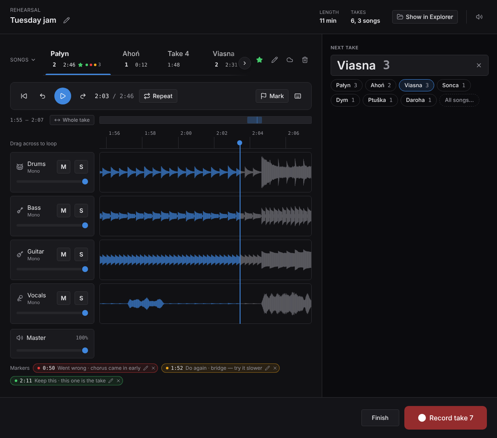

At first the whole take is on screen. To look closer, hold Ctrl (⌘ on a Mac)
and scroll the mouse wheel over the tracks, or pinch on a touchpad. The point
under the mouse stays where it is. The wheel on its own scrolls the page, as
it does everywhere else. To move along the take, swipe sideways with two
fingers on a touchpad, or hold Shift and scroll. The waveform is redrawn for
the part on screen, so you see real detail. At the closest zoom about two
seconds fit on the screen. The keys button at the end of the player's row,
or the ? key, lists all of this with the player's keys.

Above the ruler is a map of the whole take. Zoomed in, the blue stretch on
it is the part on screen, and the orange one is the selection, if there is
one. At the closest zoom the map says so. Drag the blue stretch to move along the take, or
click anywhere else on the map to go there. Zoomed in, **Whole take**, beside the
map, zooms back out. The buttons beside the selection's times and Crop are
only on screen with the selection: zoomed to another part of the take, go
back to it on the map or with Whole take.

While a take plays, the view follows the playhead. If you scroll away, it
stops following until the playhead comes back into view.

## Names and songs

Each take is a go at a song. You name it with the song's title, and the app
counts the goes: the number beside the name, "Pałyn 1", "Pałyn 2", goes on
from one rehearsal to the next, so "Pałyn 17" is one take wherever it was
played. Deleting a take does not free its number. A new take is another go at the song before it, so you only name a
take when the band moves on to another song.

Type the title only; the number is the app's. Typing "Pałyn 5" names the
take Pałyn, at whatever go is next. A song is spelled one way everywhere:
typing "pałyn" gives "Pałyn" when that song is there. A title can end in a
number, like "Opus 5", as long as no song is called "Opus". A take nobody
named is called by its number, "Take 4", is not counted as a song, and so is
a recovered take you did not name. On the rehearsal screen and in History,
the songs are listed under such a take, so one click names it.

Wherever you name a take, the songs you have already played are listed under
the name, so you do not have to type them again. Each song comes with the go
it would be, dimmed beside it; a click puts only the title in the field.
Typing narrows the list to the songs that match, and clicking one then takes
you out of the field, so the next Space records or saves. In the Rename take
dialog you stay in the field, and Enter renames.

Elsewhere a song's title opens the song's page in History: in Last time on
the setup screen, and as a song's heading in a rehearsal's overview. **Not
named** opens the page of the takes nobody named. The songs listed under a
name field are the exception: they only fill the field.

To rename a take or a rehearsal later, use the pencil button on the rehearsal
screen or in History. The folder on disk is renamed too, and a rehearsal
folder keeps its date: `Tuesday jam - 2026-09-18 19-00`. If you rename a take
that is open in the player, it starts again from the beginning.

## History

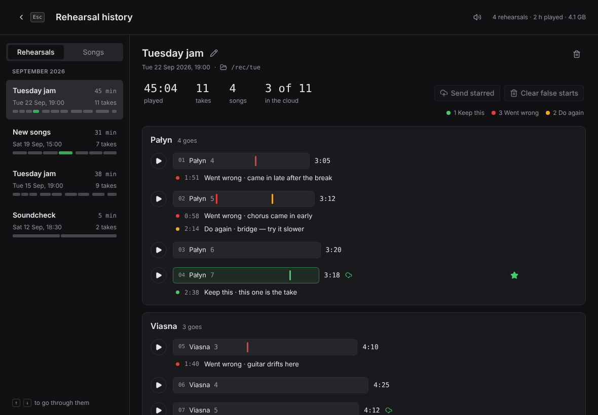

**History** has two views, switched at the top of its list: **Rehearsals**,
evening by evening, and **Songs**, song by song. It opens on the one you used
last, or on the rehearsal or song you opened from the setup screen.

**Rehearsals** lists your past rehearsals down the left, by month, and shows
the chosen one beside the list. It opens on the newest. Each rehearsal in the
list shows when it was, how long you played and how many takes there are,
with the evening drawn as a strip: a bar for each take, as long as the take,
grouped by song, and green for a starred take. You can see at a
glance how many songs you played and how many goes each one got.

Click a rehearsal to show it, or go through them with ↑ and ↓. Its takes
work the same way as on the rehearsal screen: **Play** on a take plays it
right there, and the take's bar opens it in the player, which then has the
whole window. Esc brings the list back. An evening is sorted here the same
way too: the songs under a take nobody named, the false starts, **Send
starred** and **Clear false starts**.

You can rename and delete takes and whole rehearsals here. The pencil and
the bin next to the rehearsal's name work on the rehearsal. Deleting asks
first, tells you how much space it frees and moves the folder to the Trash.
The header shows how many rehearsals there are, how long you played in all
and how much disk space they take.

If a rehearsal's folder was moved or renamed outside the app, or is on a
drive that is not plugged in, the rehearsal is marked **Not found on disk**.
**Locate folder…** lets you show the app where the folder is now.
**Remove from history** takes it off the list without touching any files.

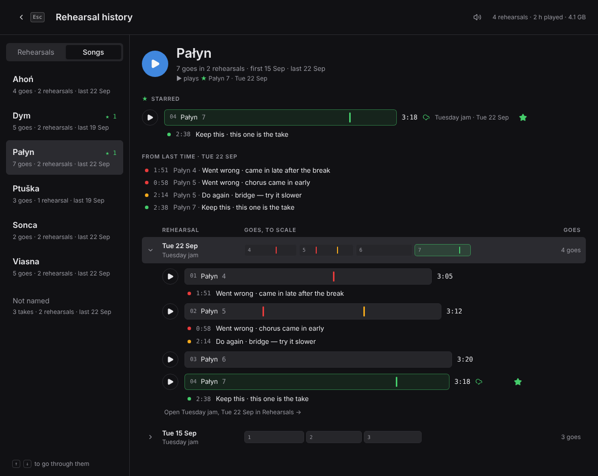

**Songs** lists every song you have played, alphabetically, with how many
goes and rehearsals it had, when it was last played and how many of its goes
are starred. The takes nobody named come last, as **Not named**. Click a
song, or go through them with ↑ and ↓.

A song's page starts with a big **▶**, which plays its newest ★ go, or its
last go when none is starred. Its ★ goes come next, then the marks left on it
the last time it was played; a mark opens its take at that spot. Then every
go at the song, one line a rehearsal, newest first: the rehearsal's day and
name, and its goes as bars side by side, all drawn to the song's longest go.
A go that ran long or stopped short shows without reading a number; a ★ go is
green, and a mark is a tick in its label's colour.

Click a line to open it to its goes, and again to close it. The newest
rehearsal is open to begin with, and the lines you open stay open while
History is. The goes in an open line play, open in the player, take a star,
are renamed or deleted, as they are anywhere else, and **Open … in
Rehearsals** under them shows the whole evening. Esc from the player comes
back to the song, scrolled where you were.

A rehearsal whose folder is not on disk stays on a song's page, greyed and
marked **not on disk**. Its goes are counted, but they cannot be played or
opened until the drive is back.

## Sending takes to the cloud

Most of a rehearsal is attempts that did not work out, so the app does not
sync your whole recordings folder. Instead, set a cloud folder in
**Settings → Folders**: a folder that Google Drive, Dropbox or a similar app
already syncs. Only the takes you choose are copied there.

There are three ways to send takes:

- **By hand:** press the cloud button on a take and choose what to send. The
  copy is made in the background, so you can keep working.
- **The starred ones:** **Send starred**, over the takes on the rehearsal
  screen and in History, sends every ★ take of the evening that is not in
  the cloud folder yet and not waiting to go. Its tooltip says why when
  there is nothing to send.
- **Automatically:** turn on **Send saved takes automatically** in Settings.
  Every take is then copied after you save it. Nothing is copied while a take
  is recording. This setting needs a cloud folder, and it turns off if you
  remove the folder.

You can send one of three things. By hand you choose each time; for
**Send starred** and for automatic sending you choose once in Settings,
under **What gets published**. Choosing there does not turn automatic
sending on.

- **The mix:** one stereo file, mixed with the balance you set in the player.
  This is the one to send to the band. If the tracks together would clip, the
  level is lowered automatically.
- **The original tracks:** every track as recorded, for editing later in a
  DAW.
- **Both.**

In Settings you also choose the format of the copies:

- **As recorded:** WAV, the same as the files on disk.
- **Lossless (FLAC):** about half the size, and it sounds exactly the same.
- **Compressed (MP3):** about a tenth of the size, with some loss of quality.
  Good for a mix people listen to on their phones, not for tracks you want to
  edit later.

Your recordings on disk always stay WAV. Only the copies are converted.

### Following the copies

Each take shows where its copy is: "Waiting for the cloud", "Copying to the
cloud", a green cloud button once it is there, or "Not in the cloud" with the
reason if something went wrong.

The button next to **History**, at the top of every screen, shows work
running in the background: "1 working · 64%" while a copy is made, then
"Done", or "1 failed" in red. Click it to see what happened, and to **Retry**
a copy that failed. The same list shows takes being cropped, saved or
recovered.

Sending a take again replaces its earlier copy. **Remove from the cloud**
deletes the copies but not the recording.

A take that is in the cloud stays the same there as on the laptop, in any
rehearsal, however it was sent, and whether automatic sending is on or not:

- Rename a take or a rehearsal, and its copies in the cloud get the new name.
- Crop a take, and its copy is made again from the cropped take: the mix, the
  tracks or both, whatever was there before.
- Delete a take or a rehearsal, and its copies go to the Trash with it; the
  question before deleting says so. A rehearsal's folder in the cloud goes
  once nothing is left in it.

If you move a fader, or change the format or the cloud folder, the takes of
the rehearsal in progress are sent again with the change. Takes of older
rehearsals keep the copies they have; send one again by hand if you want it
redone.

If the cloud folder is not available, for example because the Drive app is
signed out or a drive is unplugged, the take says so. The next take you save
also sends the ones that could not go before.

## Recording quality

**Bit depth: 16 or 24.** Use 24. At a rehearsal nobody watches the input
levels, and the drummer plays harder in the chorus than at the soundcheck.
With 24 bits you can set the inputs low and the quiet parts still sound
clean. It takes one and a half times the disk space of 16 bits: for eight
tracks at 48 kHz, about 4.1 GB an hour instead of 2.8 GB.

**Sample rate: 44.1, 48 or 96 kHz.** Both 44.1 and 48 kHz are fine for a
band. 96 kHz doubles the disk space, for a difference nobody will hear in a
rehearsal room. Some interfaces only run at the rate they are set to. The
XR18, for example, runs at the rate set on the mixer, so choose that one.

Only the combinations your interface accepts are offered. If the interface
does not answer when the app asks, Settings says so.

Old rehearsals keep playing whatever quality they were recorded at. The mix
sent to the cloud is always 16-bit, so that any phone can play it.

## Changing the interface

The list of musicians stays the same whatever interface you use, and each
interface remembers which input each musician is on. You can rehearse with
the XR18, record at home on a small two-input box, and come back: each
interface brings back its own inputs.

The first time an interface sees a musician, it puts them on the lowest free
input. Check that it is the right one: the app knows that the input is free,
not what is plugged into it.

If there are more musicians than inputs, the ones who do not fit are shown
without an input, and the rehearsal cannot start until every track has one.
Decide who sits out and remove their tracks.

Removing a track removes that musician on every interface.

### An interface switched on after the app

The app looks for interfaces when it starts. If you switch on the mixer
after opening the app, it is not in the list yet. The setup screen then says,
for example, "“X18/XR18” is not connected", with a **Look again** button.
Press it once the mixer has started. Settings has the same button next to
the list of interfaces.

The app never looks again on its own, and never while recording: on Windows
it restarts every ASIO driver when it looks.

### Stereo instruments

A keyboard has two outputs, and so does a pair of overhead microphones. Press
**Stereo** on a track to record its input and the next one together, as one
stereo file. The input then shows a pair, for example "Inputs 9–10".

Both inputs have to be free. If the next input already belongs to another
track, the stereo track waits for an input and the screen says so.

A stereo track stays stereo when you change interfaces. Its tile on the
recording screen is split into left and right, and its waveform and its
meter in the player show left above right, so you notice straight away if
one microphone stops working. A
stereo track takes twice the disk space of a mono one.

## Keyboard

Space does the main thing on each screen: start the rehearsal, start a take,
stop recording, save the take, or play and pause while listening. The button
it presses shows the key.

While listening:

| Key | Does |
|---|---|
| ← and → | jump 10 seconds back or forward |
| Home | go back to the start |
| ↑ and ↓ | the previous or next go at the open song, at the same place |
| M | add a marker |
| R | turn Repeat on or off |
| ? | show the keys |

In History, with no take open, ↑ and ↓ go through the rehearsals, or the
songs in the Songs view.

Esc goes one step back. It closes a dialog first, then the strip's columns,
then the open take, then a take playing in the list of takes, then the
screen. On the rehearsal screen it finishes the rehearsal, and asks first
if there are takes in it; the start screen comes next. After a take, it
asks before discarding the take. Esc never stops a recording; press
**Stop** for that.

While you are typing in a text field, the keys type. Press Esc to leave the
field, and the keys work again.

Clicking a button or moving a fader with the mouse does not take the keys
away. Space still does the main thing, and the other keys still work. To
press a button with Space, move to it with Tab.

## When something goes wrong

### The interface will not open, or sends no sound

Checking the signal or starting a take can fail with a message that ends in
`[PaErrorCode -9999]`. It means the driver refused without saying why, and it
happens almost only with ASIO on Windows. Or the interface opens but the bars
do not move, and after a few seconds the app says there is no sound from it.

The most common reason is that an ASIO interface can only be used by one
program at a time. Close any other program that might be using it: a DAW,
the interface's own mixer or control app, or a second copy of Rehearsal
Recorder. Then try again.

If that does not help, the app can test the interface for you. Open
**Settings**, go to **Under the hood** and press **Check the interface**.

Play or talk into the inputs while it listens. If sound arrives, it says so
and lights up the inputs that had signal. That takes about five seconds. If no
sound arrives, it tries several more times, changing one setting each time,
and then tells you what is wrong and what to do. An interface that opens but
sends nothing can take up to a minute to test; **Stop** ends it early.

If it says that the driver only works with its outputs opened too, or that
the interface opens but sends no sound, record through WASAPI for now. The
same interface is listed there too, usually with fewer inputs. The Realtek
ASIO driver that comes with some laptops is known to behave like this.

To ask for help, press **Copy details for a bug report** on the same page and
paste what it copies into your message. It says which version you have, what
the computer is, which interface and settings you record with, what the last
check found, and where the app keeps its files. The **Show** buttons there
open the folder with the settings, the history or the crash log, if someone
asks you to send one.

The same test also runs from a terminal, in the folder where you unpacked the
app, which can test another interface too — add its number from the list it
prints:

```
Reha.exe --audio-probe
```

### The interface goes away during a take

If the interface is unplugged or switched off during a take, the take stops
on its own after three seconds without sound. Everything recorded until then
is kept, and the take opens as usual, with a note saying why it stopped. Plug
the interface back in and record the next take. If it is not offered, press
**Look again** in Settings.

When a stream has just started, the interface gets five seconds to send its
first sound, because some drivers take a moment to start.

The signal check stops in the same way, and playback pauses. Press play once
the interface is back. If it is still gone, the take plays through the
computer's own output.

Sometimes a driver does not recover after its interface disappears. The take
is still saved, after about fifteen seconds, and until the driver responds
again the app says "The audio driver has stopped answering". Unplug the
interface and plug it back in. If that does not help, restart the app.

### The app closed during a take

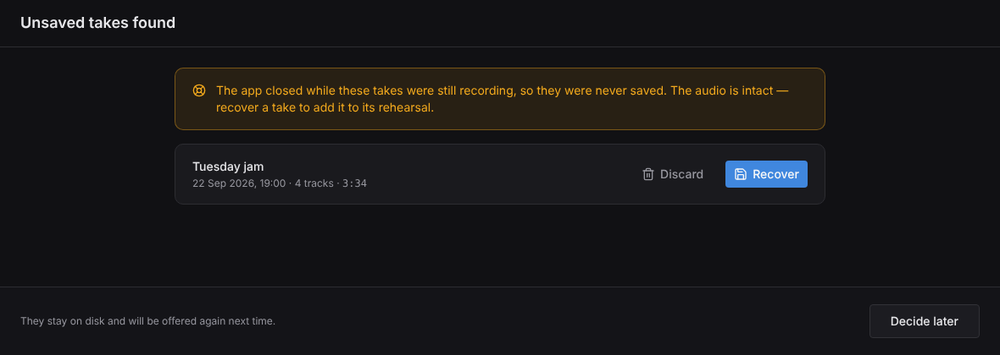

The app writes every track to disk while you play, and makes sure it is
saved every 30 seconds. If the app closes or crashes during a take, you lose
at most the last half minute.

Next time you open the app, it offers these takes first. **Recover** adds a
take to its rehearsal, **Discard** moves it to the Trash, and **Decide
later** keeps it for next time. Closing the window during a take works the
same way: the take stops and is offered the next time you open the app.

## Where the files are

Recordings are kept in the **RehearsalRecordings** folder in your home
folder, for example `C:\Users\alex\RehearsalRecordings` on Windows. You can
choose another folder in **Settings → Folders**. **Settings → Under the
hood** shows the exact paths.

```
RehearsalRecordings/
  library.sqlite                     the history: rehearsals, takes, markers
  Tuesday jam - 2026-09-18 19-00/
    _drafts/
      take 3/                        the take being recorded right now
        Drums.wav
        Vocals.wav
    01 - Verse riff/                 saved take 1
    02 - Verse riff 2/               saved take 2
```

While a take records, it is written to `_drafts`. **Save take** moves it into
its own folder, and **Discard** moves it to the Trash.

Deleted takes and rehearsals go to the Trash or the Recycle Bin. On a
computer without one, they go to a `_deleted` folder inside the recordings
folder.

Rehearsals with no saved takes are removed on their own. A folder that still
holds an unsaved take, or any other file, is left alone.

Keep the recordings folder on the computer's own disk. Do not put it in a
folder that Google Drive or Dropbox syncs, and do not put it on a network
drive. The history file changes while the app runs, and a sync app can
damage it. To share takes, use the cloud folder instead.

To move the recordings folder to another disk or computer, close the app
first, then move the whole folder.

If you go back to an older version of the app after this one has opened the
recordings folder, the older version may show an empty history, or refuse to
open the folder. Your recordings are not affected.

## Marks and their labels

A mark's label is a name and a colour: *Note*, *Keep this*, *Went wrong*
and *Do again* to start with. In **Settings → Marks** you can make your own
(*Solo*, *Tempo*, *Lyrics*, whatever the band marks), rename them, give them
another colour from the palette of eight, drag them into another order and
delete them.

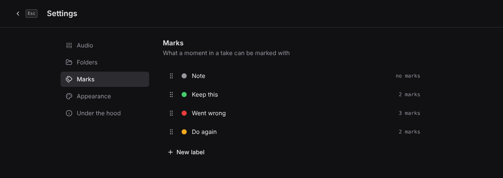

- The order is the order of the buttons when you mark a moment, and a new
  mark gets the first label.
- Renaming or recolouring a label changes every mark that has it, in every
  rehearsal.
- Each label says how many marks have it. One with none is deleted at once.
  For one in use, the app asks which label its marks get instead.
- The last label cannot be deleted: every mark needs one.
- Under a take, every mark is listed, by its label's name and then its
  comment, if it has one.

A label does nothing else: it changes how its marks look and what they are
called.

## Appearance

In **Settings → Appearance** you can choose a dark or light theme, or follow
the system. You can also scale the whole interface from 90% to 150%.

## A new version

When a newer version is out, a dot appears on the gear on the setup screen,
and another on **Under the hood** in Settings. There, the **Updates** section
under the card with your version says which one is out, and **What's new**
opens its page on GitHub. The dots stay until you run the new version. When
there is nothing newer, the same place says so — once GitHub has answered;
until then it says it has not checked yet.

**Download** fetches it for your system into your Downloads folder, checks
that it is the release's own and that nothing in it is damaged, and opens the
folder with it picked out. Unpack it, close the app and open the new copy.
The old copy is not touched, so you can keep it until you are sure. On
Windows a zip the app downloads itself carries no "from the internet" mark,
so there is nothing to unblock. If the
download is cut short or damaged, nothing is left behind and **Try again**
fetches it again. A download that is already there and whole is not fetched
twice.

To find out, the app asks GitHub which version is the latest when it starts,
and once a day while it stays open. It sends nothing else, it downloads only
when you press **Download**, and it never asks while a take is recording.
With no internet in the room it simply does not find out. **Check for new
versions** in **Settings → Under the hood** switches the asking off.
